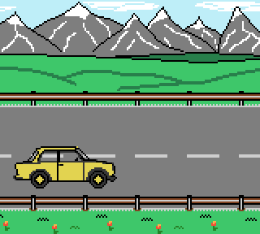

# Trabant
_Any existing thing in this world can be either non-sense or art. Programming is both._

This repo is part of [HomebrewOwl.GB](https://github.com/NotImplementedLife/HomebrewOwl.GB "HomebrewOwl") projects collection.
This is a [GB Compo 2021](https://gbdev.io/gbcompo21/) game entry. 
Download the latest version [here](https://github.com/NotImplementedLife/Trabant/releases/download/1.0/Trabant_1_0.gb).

## The idea

Side project I started while thinking about what to add/repair in my [Breksta's Cat](https://github.com/NotImplementedLife/brekstascat) game. 
Eventually, it turns out this is my first GBC ROM (a demo, to be more precise) about driving featuring a simple parallax method. As I want to also submit this thing as a
[GB Compo 2021](https://itch.io/jam/gbcompo21) entry and I don't have time to finish it, I'll leave it just like it is, in a "proof-of-concept" state.

## How to build

```
git clone https://github.com/NotImplementedLife/Trabant --recursive
```

```
cd Trabant
make
```

Make sure RGBDS is installed and exists in your `%PATH%`.

## How to play

- Press `Up`/`Down` or `Left`/`Right` to move the Trabant on the road
- Press `A`/`B` to change the speed.

## Screenshots

</img>

## Credits

- [Optix™](https://github.com/Hacktix) who created the GB Compo 2021 logo

## Linked

- [HomebrewOwl.GB](https://github.com/NotImplementedLife/HomebrewOwl.GB "HomebrewOwl.GB") - check out my other Gameboy projects
- [GB Compo 2021](https://itch.io/jam/gbcompo21) itch.io page
